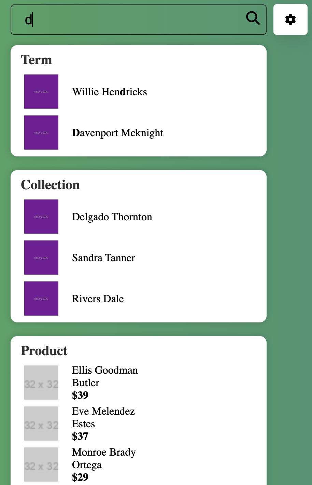
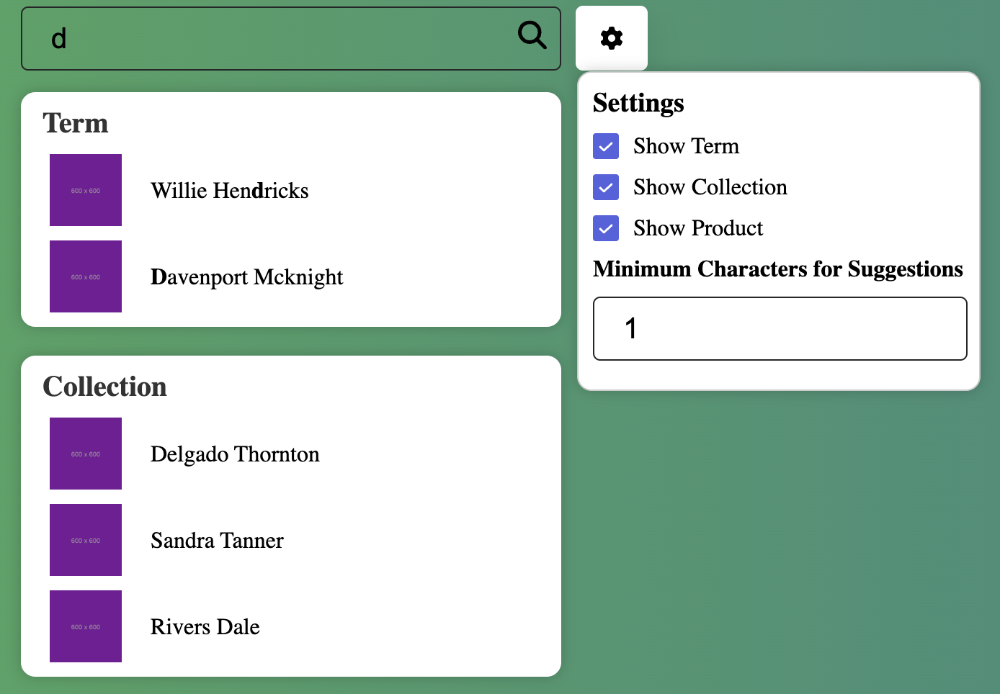

# Getting Started with Create React App

This project was bootstrapped with [Create React App](https://github.com/facebook/create-react-app).

## Available Scripts

In the project directory, you can run:

### `npm start`

Runs the app in the development mode.\
Open [http://localhost:3000](http://localhost:3000) to view it in the browser.

The page will reload if you make edits.\
You will also see any lint errors in the console.

### Feature search AutoSuggestion and Setting panel for this.

1. Search suggestion



2. Setting search auto suggestion



### Tutorial use component AutoSuggestion for Search box

- Import component `SuggestionBox` and after pass props that necessary for this component

- This component have 2 props is required: 
  - `data`: type data is an object
    example: data type
    ```javascript
      export type ProductType = {
        id: string;
        title: string;
        url: string;
        brand: string;
        price: string;
        image: string;
      }

      export type CollectionType = {
        id: string;
        title: string;
        url: string;
      }

      export type SuggestionTermType = {
        id: string;
        title: string;
        url: string;
      }

      data = {
        collections: CollectionType[],
        products: ProductType[],
        suggestion_terms: SuggestionTermType[],
      }
    ```

  - `handleSearch`: This is function will set value search input after we chose an value from box suggestion and use this value to call API search for each value.
  Example: 
  ```javascript
    const [searchValue, setSearchValue] = useState('');

    const handleSearch = (title: string) => {
    setSearchValue(title);
    };

    // use searchValue to call api search that you want
  ```
